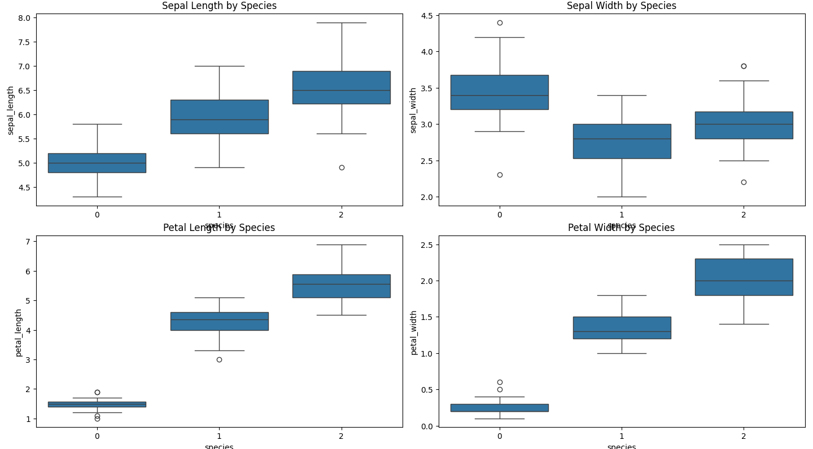
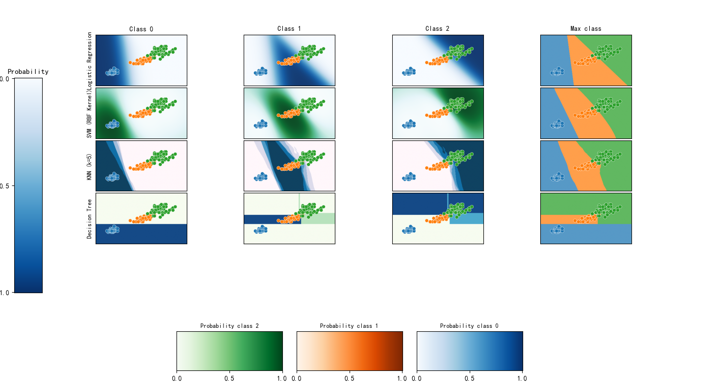
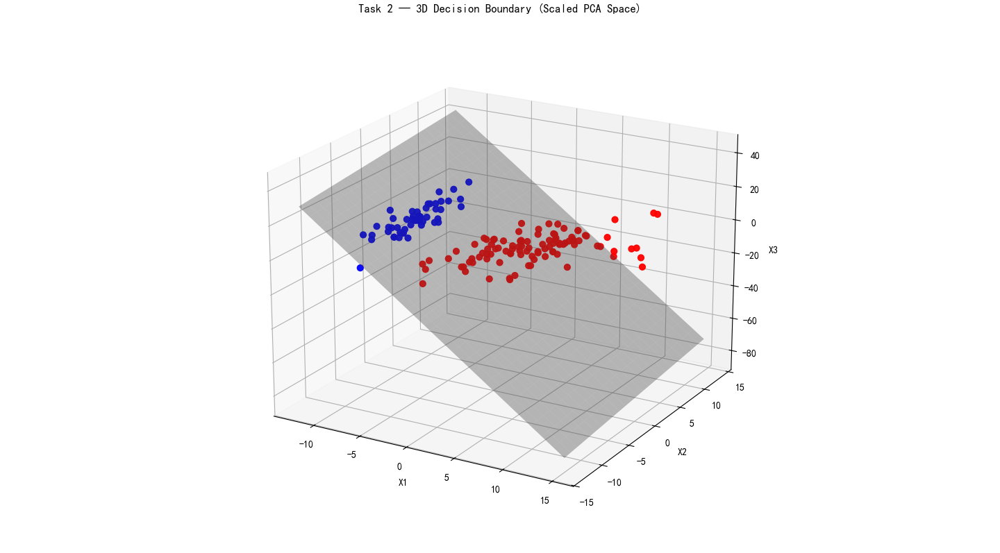
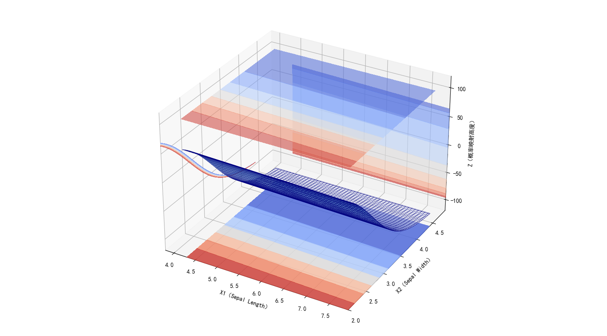

# Iris-Data-Classification-and-Visualization

# 📘 Project 3：鸢尾花数据分类与可视化

# —— README.md

## ⭐ 项目简介

本项目使用 *Iris 鸢尾花数据集*，通过 **Logistic Regression（含 Softmax）** 完成：

* 2D 多分类决策边界可视化
* 3D 两分类决策边界可视化
* 3D 两分类概率图可视化
* 3D 三分类 + 概率图 + 决策边界（加分项）

所有可视化图均与课程 PPT 要求一致，并补充了兼容的工具文件（classifier2d.py）用于统一绘图风格。

---

# 📂 项目文件结构

```
Project3/
│── images/                   # 存放生成的 png 图片
│      ├── data_preview.png
│      ├── Sepal Length vs Sepal Width.png
│      ├── Sepal Length vs Petal Length.png      
│      ├── Sepal Length vs Petal Width.png
│      ├── Sepal Width vs Petall Length.png
│      ├── Sepal Width vs Petal Width.png
│      ├── Petal Length vs Petal Width.png
│      ├── task1.png
│      ├── task2.png
│      ├── task3.png
│      ├── task4.png
│
│── classifier2d.py           # 工具文件：中文字体、2D 数据加载、2D 决策边界绘图
│── data_preview.py           # 数据预览（箱线图与交互式散点图）
│── task1_multiclass_2D.py    # 任务 1：三分类 2D 决策边界
│── task2_3D_boundary.py      # 任务 2：两分类 3D 决策边界
│── task3_3D_probability.py   # 任务 3：两分类 3D 概率图
│── task4_combined_3D.py      # 任务 4：三分类三特征 3D 决策边界 + 概率图（四图合一）
│── README.md                 # 本文件
```

---

# 🧪 数据集说明

使用 scikit-learn 自带的 **Iris** 数据集，包含 150 条鸢尾花样本：

| 特征（Features） | 含义   |
| ------------ | ---- |
| Sepal Length | 萼片长度 |
| Sepal Width  | 萼片宽度 |
| Petal Length | 花瓣长度 |
| Petal Width  | 花瓣宽度 |

分类（Species）：

* 0：Setosa
* 1：Versicolor
* 2：Virginica

---
🖼 数据展示

📊 数据预览（箱线图 + 交互式散点图）



---

# 📝 任务说明

---

## 🎯 Task 1 — 三分类 / 两个特征（2D 决策边界）

📌 **对应文件：task1_multiclass_2D.py**

* 使用 **花瓣长度 + 花瓣宽度**（两个特征）
* Softmax Logistic Regression
* 输出包含：
  ✔ 整体三分类 2D 决策边界
  ✔ 每一类的概率热力图
* 决策边界风格与 classifier2d.py 的基础风格统一

🖼 结果示例


---

## 🎯 Task 2 — 两分类 / 三个特征（3D 决策边界）

📌 **对应文件：task2_3D_boundary.py**

* 使用前三个特征：Sepal Length / Sepal Width / Petal Length
* 二分类：

  * Setosa = 0
  * Non-Setosa = 1
* 使用 Logistic Regression
* 输出：
  ✔ 3D 决策平面
  ✔ 原始 3D 点云
* 已做标准化（StandardScaler）+ PCA + 放大点云（scale_factor）以满足 PPT 效果

🖼 结果示例


---

## 🎯 Task 3 — 两分类 / 三个特征（3D 概率图）

📌 **对应文件：task3_3D_probability.py**

* 固定第三个特征（中位数）
* 在 x1–x2 平面生成 meshgrid
* 用颜色表示 P(class=1)
* 将概率映射至 Z 轴（p=0→-100，p=1→+100）
* 绘制：
  ✔ 3D 概率曲面
  ✔ 4 个方向的概率投影（墙面＋上下平面）
* 风格与 PPT 中的 3D 概率图一致

🖼 结果示例


---

## 🎯 Task 4 — 三分类 / 三个特征（3D Boundary + Probability）

📌 **对应文件：task4_combined_3D.py**

* 三分类（0,1,2）
* 三个特征（前三个）
* 使用 Softmax Logistic Regression
* 输出 **四图合一的大图（2×2 subplot）：**

| 子图  | 内容                        |
| --- | ------------------------- |
| 图 1 | 三条决策边界（P0=P1、P0=P2、P1=P2） |
| 图 2 | P(Class 0) 的 3D 概率分布图     |
| 图 3 | P(Class 1) 的 3D 概率分布图     |
| 图 4 | P(Class 2) 的 3D 概率分布图     |

已解决：

* 标题遮挡
* 视角、透明度、颜色与 PPT 风格一致
* 网格密度控制良好（22³）
* 每个子图都叠加原始数据点

🖼 结果示例


---

# ▶ 如何运行代码

确保安装依赖：

```bash
pip install numpy matplotlib scikit-learn
```

运行方式：

```bash
python task1_multiclass_2D.py
python task2_3D_boundary.py
python task3_3D_probability.py
python task4_combined_3D.py
```

---

# 📦 每个文件的作用

| 文件名                     | 功能                            |
| ----------------------- | ----------------------------- |
| classifier2d.py         | 中文字体、通用 2D 决策边界工具             |
| data_preview.py         | 数据预览（箱线图等）                    |
| task1_multiclass_2D.py  | Task 1：2D 三分类决策边界             |
| task2_3D_boundary.py    | Task 2：两分类 3D 决策平面            |
| task3_3D_probability.py | Task 3：两分类 3D 概率图             |
| task4_combined_3D.py    | Task 4：三分类 3D 决策边界 + 概率图（加分项） |

---
